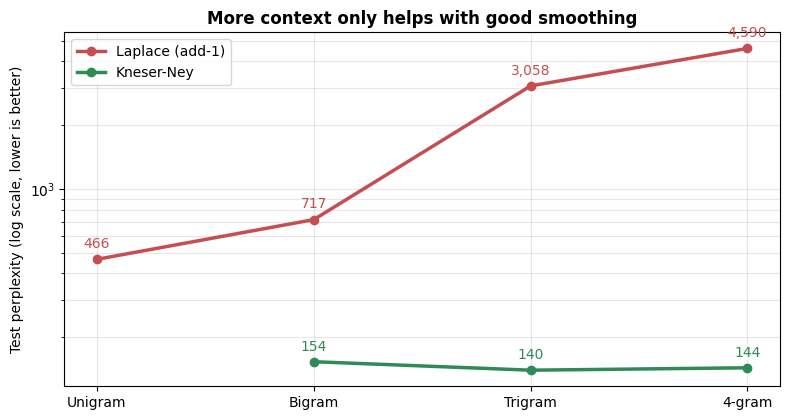
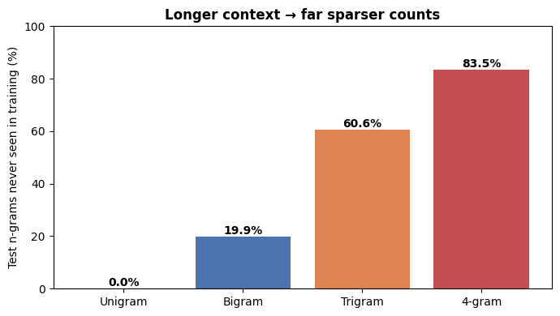
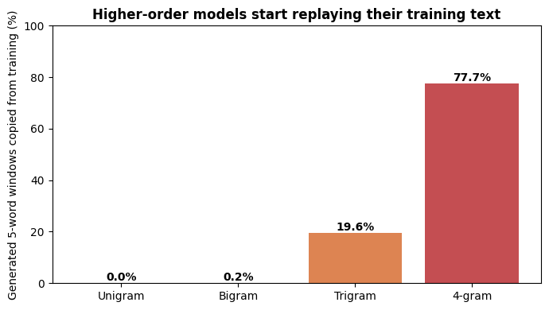

# 📖 N-gram Language Models: From Bigrams to 4-grams

[](https://colab.research.google.com/github/MMujtabaX/ngram-language-models/blob/main/ngram_language_models.ipynb)


How much context does a language model need? This project trains **unigram, bigram, trigram and 4-gram** models on three Jane Austen novels and measures the trade-off: more context means more fluent text, but also **sparser counts** and more **copying** of the training data. **Laplace** and **Kneser-Ney** smoothing are implemented from scratch and compared by perplexity, and the best model powers a working **autocomplete**.

<p align="center">
  
</p>

## 📊 Key Results

| Model | Unseen test n-grams | Copied 5-word windows* | Laplace perplexity | Kneser-Ney perplexity |
|-------|--------------------|------------------------|--------------------|-----------------------|
| Unigram | 0.0% | 0.0% | 466 | — |
| Bigram | 19.9% | 0.2% | 717 | 154 |
| **Trigram** | 60.6% | 19.6% | 3,058 | **140** ✅ |
| 4-gram | 83.5% | **77.7%** | 4,590 | 144 |

<sub>*Share of generated 5-word sequences that appear verbatim in the training novels.</sub>

**Three findings:**
1. **Smoothing decides whether context helps.** Laplace perplexity *rises* 6× from bigram to 4-gram; Kneser-Ney is 5–30× better at every order.
2. **More context isn't always better.** With 328K training words, the trigram beats the 4-gram, because 83.5% of test 4-grams were never seen.
3. **High-order fluency is partly memorization.** 77.7% of the 4-gram model's generated text is copied from the novels.

## 🔬 What's Inside

### 1. Warm-up: a bigram next-word predictor
A small hand-written corpus with a **common bug** caught and fixed: flattening sentences before taking bigrams creates 12 fake pairs across sentence boundaries, such as `('world', 'i')`. The fix is per-sentence bigrams with `<s>` / `</s>` markers.

### 2. Scaling up
*Emma*, *Persuasion* and *Sense and Sensibility*: 15,286 sentences, 328K training words and a 6,538-word vocabulary, with rare words mapped to `<unk>`.

### 3. The sparsity problem
<p align="center">
  
  
</p>

### 4. Text generation
| Order | Sample |
|-------|--------|
| Unigram | *consent proud not* |
| Bigram | *highbury included in the disclosure seldom really to miss smith she was that if not burn the least ashamed...* |
| Trigram | *to do when it was impossible to last long* |
| 4-gram | *highbury that airy cheerful happy looking highbury would be his constant attraction* |

### 5. Smoothing from scratch
- **Laplace (add-1):** adds 1 to every count, spreading probability over the whole vocabulary.
- **Interpolated Kneser-Ney:** a discount of 0.75 is moved to lower-order models that use **continuation counts**: how many *different* contexts a word follows, not how often it appears. A sanity check confirms the probabilities sum to exactly 1.

### 6. Autocomplete with stupid backoff
Try the longest context first, and back off to shorter ones (×0.4) when it's unseen. This is the method used for web-scale n-gram models.

| You type | Suggestions |
|----------|-------------|
| *it was a* | very · great · little |
| *my dear* | sir · emma · miss |
| *he was very* | much · clever · agreeable |
| *mr* | knightley · weston · elton |

The notebook also includes a **live autocomplete widget** that works when opened in Colab or Jupyter.

## 🚀 Run It

Click the **Open in Colab** badge above and choose **Runtime → Run all**. The Gutenberg novels download automatically through NLTK, and the full run takes under a minute.

```bash
pip install nltk numpy pandas matplotlib ipywidgets
```

## 💡 Takeaways

- N-gram models trade **context** against **data sparsity**. Each extra word of context multiplies the number of possible sequences.
- **Kneser-Ney** remains the classic strong smoothing method, because continuation counts capture *how versatile* a word is, not just how frequent.
- N-grams can't generalize across similar words or remember beyond n−1 words. **Neural language models** address both with embeddings and attention.

## 🙏 Acknowledgements

Started from an NLP course exercise (a bigram next-token predictor); extended with multi-order models, from-scratch smoothing, sparsity and memorization analysis, and autocomplete.

## 👤 Author

**Muhammad Mujtaba Khan Suri** — CS @ UBIT, University of Karachi
[GitHub](https://github.com/MMujtabaX)
